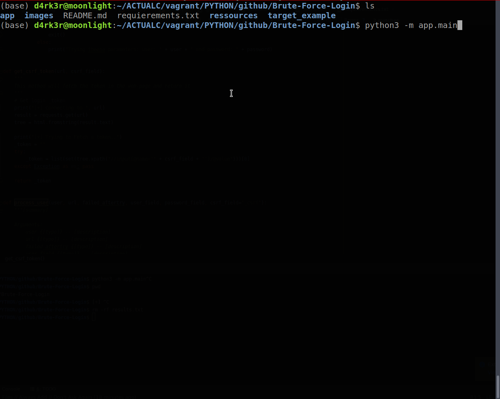
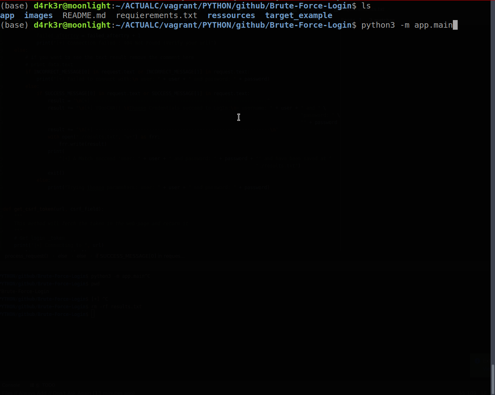
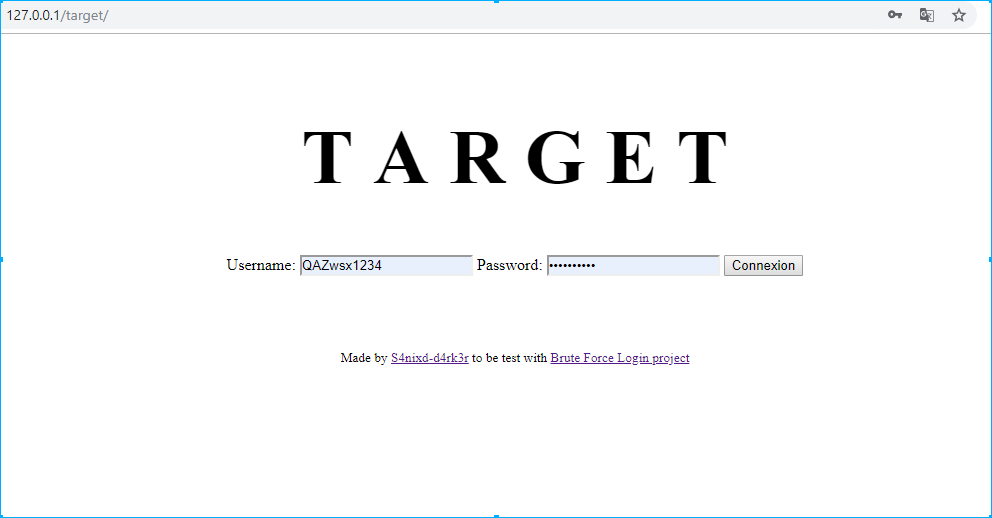

# Brute-Force-Login

Brute Force Login in a web site with Python, hack accounts on any website with a good dictionary of words.


**NOTE: AM NOT RESPONSIBLE OF BAD USE OF THIS PROJECT, it's only for searching purposes and learning environment!**

## Demo

- **Manual-Mode (You provide fields(username/password,...), 100% accurate**)<br/>


<br/>

- **Automatic-Mode (Auto-detect fields in the login form (username/password,...), 47% accurate)**<br/>



## Features:

- Perform a brute-force login on a website-target.
- Can handle a csrf-token in a form.
- Can Automatically detect form's fields in a given login url.

## How it work ?

BFL is a robot that tries to connect by exploiting the library of passwords that it has in its possession and do not stop to submit the form until it has correspondence, so you can edit the dictionary file. tx by adding your own words for a particular target!

## How to Install

Just hit this command to install python packages:
```shell
pip3 install -r requierements.txt
```

## How to use it?

Launch it via your command line
```cmd
cd C:/path/to/Brute-Force-Login
python3 -m app.main
```

## Target

The target is present at `./target` directory, it's a simple php form, when you run it, you will have this:


### NOTE:

if you don't want to deploy the target locally or doesn't have PHP install localy, you can use this link to set an attack :

- [Target LINK](http://grabme.herokuapp.com/target/) (Where you can test your attacks)
- Username : sanix
- Password : .bleach1234
- PS: on the password, don't forget the "." before b of bleach

## Some ressources for password list:

- [crackstation](https://crackstation.net/crackstation-wordlist-password-cracking-dictionary.htm)
- [insidepro](http://www.insidepro.team/)
- [skullsecurity](https://wiki.skullsecurity.org/Passwords)
- [danielmiessler](https://github.com/danielmiessler/SecLists/tree/master/Passwords)
- [berzerk0](https://github.com/berzerk0/Probable-Wordlists)
- [topics/password-cracking](https://github.com/topics/password-cracking)

## BONUS (A PASSWORD GENERATOR)

I also created a password generator for this project named [Genesis](https://github.com/Sanix-Darker/GENESIS), that can generate multiple combination of passwords base on Key Word the victims could use, Have a look there ;-)

## Author:

- [Sanix-darker](https://github.com/sanix-darker)
