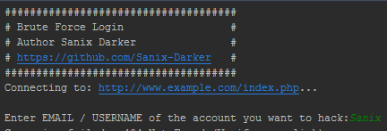

<br>
# Brute-Force-Login
Brute Force Login in a web site with Python, hack accounts on any website with a good dictionary of words 

## How it work?
BFT is a robot that tries to connect by exploiting the library of passwords that it has in its possession and do not stop to submit the form until it has correspondence, so you can edit the dictionary file. tx by adding your own words for a particular target! **[This project is in a learning environment, I am not responsible for its counterversed use]**

## How to use it?

### > Specify these configs on the top of your code
```python
# The link of the website
url = 'https://www.example.com/login.php'

# The userfield in the form of the login
userField = 'email'

# The passwordfield in the form
passwordField = 'pass'

#...
#That's it, all your configurations is done
```
### > Launch it via your command line
```cmd
cd C:/path/to/Brute-Force-Login
python BFT.py
```


